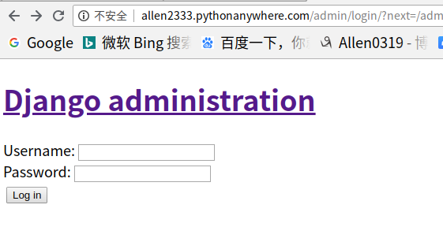
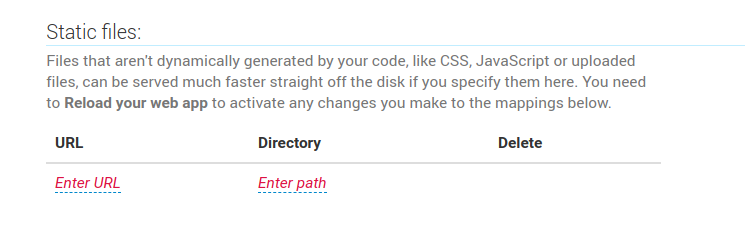
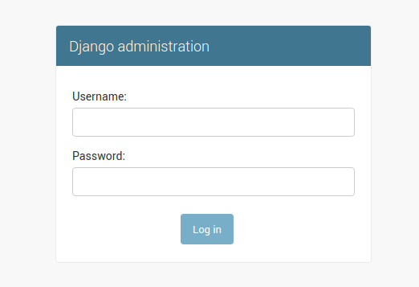
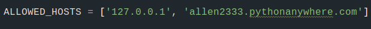

# Djangogirls_tutorial
Nice tutorial: https://tutorial.djangogirls.org

# 遇到的问题
## 部署时如何处理静态文件?
前提： ```python manage.py collectstatic```，
然后用[whitenoise](http://whitenoise.evans.io/en/stable/django.html)这个middleware去寻找静态文件的路径(就不用在云平台上配置静态文件的路径)，这个做法兼容性强，省去了云平台的依赖性。
## 例子：
如果不配置whitenoise和在平台上没有配置静态文件的路径，就在部署的云平台上运行找不到静态文件




如果配置了whitenoise并没有在云平台上配置静态文件路径，页面就能成功渲染：



## 注意：要配置允许的主机的域名，否则不能在云平台上运行
